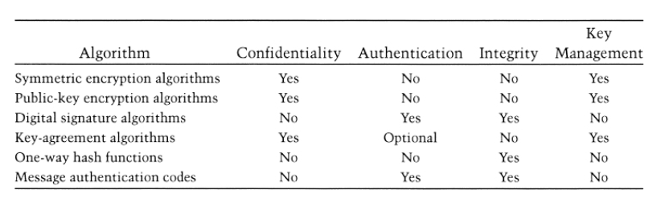
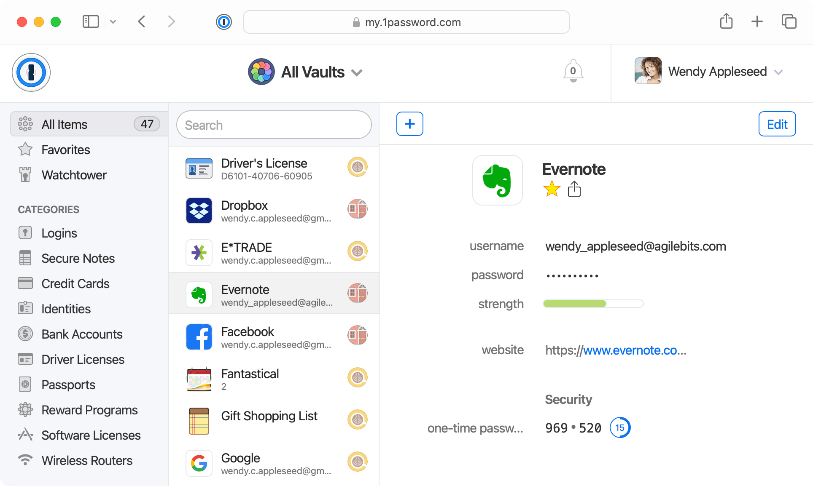

# Table of Contents
- [Schneier 2015: Applied Cryptography](#schneier-2015-applied-cryptography)
- [1password - Explaination](#1password---explaination)
- [1password - How to use](#1password---how-to-use)
- [Message encryption and decryption](#message-encryption-and-decryption)

# Schneier 2015: Applied Cryptography
We always have to think about the entire system, not just the cryptography. We have to be sure that the entire system is secure.
A designer of a system must consider every possible attack, and then design the system to be secure against those attacks.

## Chapter 10.1 - Choosing an algorithm
There is several algorithms to choose from, but we have to be sure that the algorithm is secure enough for our needs.
We can choose for example:
- A published algorithm (if no one has found a weakness in it)
- A manufacturer's algorithm (if the manufacturer is trustworthy)
- A private consultant's algorithm (if the consultant is trustworthy)
- A government algorithm (if we trust the government)
- A custom algorithm (if we have the expertise to design it)

Every algorithm has its own advantages and disadvantages. It is very hard to create a perfect algorithm, but sometimes, consultants can not create a perfect algorithm. And, for example, NSA has created a excellent algorithm, but they have not published it.

### Algorithms for Export
Algorithm for export outside the US must be approved by the US government.

## Chapter 10.2 - Public-key cryptography versus symetric cryptography
Those two types of cryptography are very different, they can not be compared.
Symetric cryptography is faster than public-key cryptography, and it best for encrypting large amounts of data.
Public-key cryptography is slower than symetric cryptography, but it can do more things than symetric cryptography. It is best for key management.

## Chapter 10.3 - Encrypting communications channels
In practice, we discovered that the encryption takes place at the lower layers of the protocol stack (link-by-link encryption), and at the higher layers of the protocol stack (end-to-end encryption).
The data stays encrypted until it reaches its destination, and then it is decrypted.



### Link-by-link encryption
Link-by-link encryption is the encryption that takes place at the physical layer of the protocol stack.
This encryption is very effective. Everything is encrypted, and any intelligent switch need to be able to decrypt the data.
The enemy can not read the data. It is called traffic-flow security.

The biggest problem with link-by-link encryption is that each physical link must be encrypted. If the network is large, it can be very expensive.

### End-to-end encryption
This method allows to encrypt only the transport data units. This method avoid the problem of link-by-link encryption.
But the main problem is that the routing information is not encrypted. The routing information is the information that allows the data to reach its destination (who is talking to who, where is the data going, etc.).

Building an end-to-end encryption system is very hard, because encryption at this level interacts with many other parts of the system.
Another major disadvantage is that the encryption allows traffic analysis.

### Combining the Two
This is the most effective method to secure a network, but it is also the most expensive.
It alsor require a more complex key management system.

## Chapter 10.4 - Encrypting data for storage
If the receiver of an encrypted message does not receive the message, the person who sent the message can not resend it.
For example, if Alice can not decrypt her message, she can not re-encrypt it and send it again. She has lost the message.
This means that the encryption should have a way to recover the message if the receiver does not receive it.

The encryption key has the same value as the message, but smaller, which means that the key can be easily lost.

### Dereferencing Keys
If you want to encrypt a large HDD, you have to options:
- Using a single key to encrypt the entire disk
- Using a different key for each sector of the disk

The first option makes it impossible to allow multiple people to access the disk.
The second option will force users to remember a large number of keys.

### Providing Random Access to an Encrypted Drive
To be able to access individual sectors of an encrypted drive, you can use the sector address to generate the key.

# 1password - Explaination
1password is a password manager that allows you to store all your passwords in one place, and access them from all your devices.
It also allows you to generate strong passwords, but it also allows you to store other types of information, such as credit card numbers, addresses, and notes.

## Threats protection
1password protects you from vulnerabilities and other security threats.
Our master password is the only thing that you need to remember, and it protects all your data. This master password is never sent to the network, and it is never stored on your device.
1password protects you by doing the following:
- Allows you to generate strong unique passwords for each website
- Allows you to generate random passwords (which are not based on a dictionary)
- Warns you if you are using a weak password
- Protects you from phishing attacks (by checking if the website is legitimate)
- Works only with verified navigators
- Always asks you to confirm your master password before accessing your data
- Auto-lock feature, which locks your data after a certain amount of time

## Encrypted data
Your master password is used to encrypt your data, but also to decrypt it. The master password is never sent to the network, and it is never shared with 1password.

1password uses:
- End-to-end encryption, which makes it impossible for someone to learn anything about your data, even if they have access to your device or if they intercept your data.
- 256-bit AES encryption, which is a very strong encryption algorithm.
- Secure random numbers, which are used to generate encryption keys, and so on.
- A secret 1Password account password, it means that your password is never sent to the network.
- Secret Key, which is used to encrypt your data. This secret key allows you to access your data if you lose your master password.

## License
If you want to become a 1password user, you have to pay a subscription fee.
But it will allows you:
- To use 1password on all your devices
- To have an application for Android, iOS, Windows, Mac, and Linux
- To store more than just passwords
- To keep your data synchronized between your devices and close to you
- To have two-factor authentications
- To protect you data with Travel Mode (which removes your sensitive data from your devices when you are traveling)

## Where is the data stored
1Password data is not stored on a central server. It means that they don't have your data.
By default, your data is stored locally on your devices. But if you choose to use the ICloud or Dropbox sync, then an encrypted copy of your data is stored on the ICloud or Dropbox servers (but your master password is not stored anywhere). But even if you choose to use the ICloud or Dropbox sync, your data is still encrypted with the AES-256 encryption algorithm, which is a very strong encryption algorithm.

## How data is protected
As mentioned before, your data is encrypted with the AES-256 encryption algorithm.
It means that all your passwords and other saved items are private. Only you can access them, and only you can decrypt them.
Your metadata (such as the name of your vaults, the name of your items, etc.) is also encrypted and private.

# 1password - How to use
1. Sign up for a 1password account (there are several options)
2. Download the 1password application on your device and log in
3. Import your data from another password manager (if you want to)
4. If you don't have a master password, you can create one
5. Install 1Password in your browser (it will allow you to access your passwords from your browser, but also to modify them from your browser)
6. Install 1Password app on you other devices



# Message encryption and decryption

## GnuPG Installation
First, I had to update my system by running the following command:
```bash
$ sudo apt-get update
```
Then, I installed GnuPG by running the following command:
```bash
$ sudo apt-get -y install gnupg
```

## GnuPG Key Generation
First, we must generate a key pair.
```bash
$ gpg --full-generate-key
```
Then, we must choose the type of key we want to generate:
- RSA and RSA (default)
- DSA and Elgamal
- DSA (sign only)
- RSA (sign only)

I choose the default option, which is RSA and RSA.

Then, we must choose the key size (between 1024 and 4096 bits).
I choose 4096 bits.

Then, we must choose the expiration date:
- 0 = key does not expire
- <n> = key expires in n days
- <n>w = key expires in n weeks
- <n>m = key expires in n months
- <n>y = key expires in n years

I choose 0, which means that the key does not expire. And after, I had to confirm my choice.

Then, we must write our name and our email address and confirm them.
- Name: Brenda
- Email: bgz132@myy.haaga-helia.fi
- Comment: -

Then, we must write a passphrase and confirm it.
- Passphrase: ILoveMyCat

## Create a Revocation Certificate
A revocation certificate is a file that allows you to revoke your key.
```bash
$ gpg --output ~/revocation.crt --gen-revoke bgz132@myy.haaga-helia.fi
```
Then, I had to write my passphrase and add reason for revocation.

## Encrypt a Message
First, I wanted to see all the keys that I have.
```bash
$ gpg --list-keys
```
 The result is:
```bash
/home/brenda/.gnupg/pubring.kbx
-------------------------------
pub   rsa4096 2023-02-27 [SC]
      36F767A18D206B3B538AB7700BFD529C300A1D36
uid           [ultimate] Brenda (-) <bgz132@myy.haaga-helia.fi>
sub   rsa4096 2023-02-27 [E]
```
The key under the pub line is the public key that is used to verify the signature of a message.
The key under the sub line is the public subkey that is used to encrypt a message.

Then, I wanted to see all the secret keys that I have.
```bash
$ gpg --list-secret-keys
```
The result is:
```bash
/home/brenda/.gnupg/pubring.kbx
-------------------------------
sec   rsa4096 2023-02-27 [SC]
      36F767A18D206B3B538AB7700BFD529C300A1D36
uid           [ultimate] Brenda (-) <bgz132@myy.haaga-helia.fi>
ssb   rsa4096 2023-02-27 [E]
```
The key under the sec line is the secret key that is used to sign a message.
The key under the ssb line is the secret subkey that is used to decrypt a message.

Then, I wanted to encrypt a message.
First, I created a file that contains the message that I wanted to encrypt : HelloWorld
```bash
$ echo HelloWorld > message
```
Then, I encrypted the message.
```bash
$ gpg --output encryptedMessage.gpg --encrypt --recipient bgz132@myy.haaga-helia.fi message
```
The --recipient option is used once for each recipient and takes an extra argument specifying the public key to which the document should be encrypted.

Then, we can verify that the message has been encrypted.
```bash
$ cat encryptedMessage.gpg
```
The result is:
```bash
�
 #�O��\�H�B����4��i�(�0Y�a +�*�b�-b�;�pH��u��<���
                                                 �1�'e� j�����1PF�U���j���E������(��1��I����h� �L|�V��_�
��<a�@D�s�    6�״��O�ۚ�]E��q��v'j���S�2I4��T��Բ
��|";��-��ζ��E��͏�}㥥X2��o�6���`_-��&�~�։��d�
                                            Q�EC}��J��V"��@Y�zi8���؀wM�0Ң����z�,�f���I��ʞ�Z�Y����v/V1;�7����D{U ވ��m�c�Z)I�n���#U��A��9�$���T��AW0{��Jv��K�7�
                                                                             ��(���z�gte��E{Q�\.r�ύ�N8Ѯe]�zΞ{�T�}��\ɒ�p�<#�V�4`��`D����ŏ�S��!�y�\����zKYU��oe�֦���u���i���D�����u΢���'x%f��.����M�N
                                  G�|޹bw
                                        ��b�gm�a�q���ܽ	��F�P�dp�ط;�?B��)Y�q��(���p�2��џ�¢��
```

## Decrypt a Message

Then, I wanted to decrypt the message.
```bash
$ gpg --output decryptedMessage --decrypt encryptedMessage.gpg
```
Then, we can verify that the message has been decrypted.
```bash
$ cat decryptedMessage
```
The result is:
```bash
HelloWorld
```